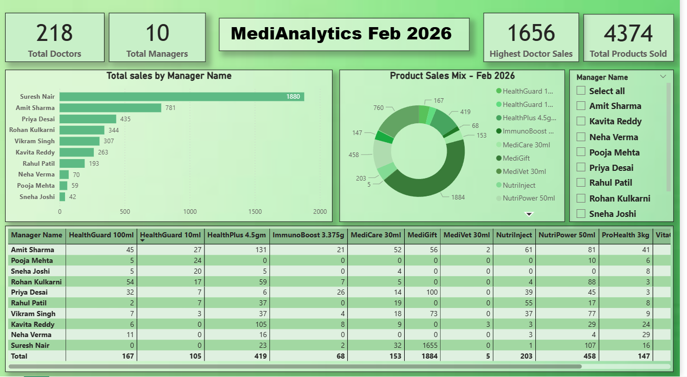
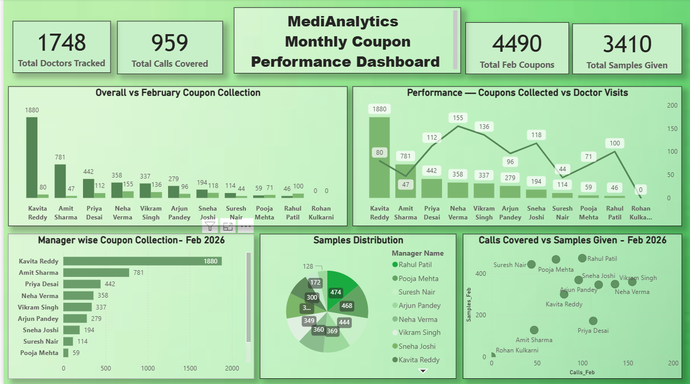

# 📊 MediAnalytics Healthcare — Power BI Report Dashboard
### February 2026 | End-to-End Data Analytics Project



---

## 📌 Project Overview

This project presents a complete **end-to-end data analytics solution** for MediAnalytics Healthcare Pvt. Ltd. for February 2026. 

Two interactive Power BI dashboards were built from raw Excel data to help management track:
- **Product-wise sales performance** across all representatives
- **Coupon collection, doctor visits and sample distribution** across the field team

The project covers the full analytics workflow — from raw data cleaning and anonymization to building interactive dashboards with actionable business insights.

---

## 📁 Repository Structure

```
Medianalytics_Healthcare_Report_Dashboard/
│
├── Product_Analysis_Feb2026.csv        ← Product sales data
├── Coupon_Collection_Feb2026.csv       ← Coupon & field activity data
├── Medianalytics_dashboard_pdf              ← Product dashboard export
                                             ← Coupon dashboard export
│
└── screenshots/
    ├── dashboard_product_overview.png  ← Product dashboard full view
    ├── dashboard_product_filtered.png  ← Product dashboard filtered by rep
    ├── dashboard_coupon_overview.png   ← Coupon dashboard full view
    └── dashboard_coupon_filtered.png   ← Coupon dashboard filtered by rep
```

---

## 🛠️ Tools & Technologies

| Tool | Usage |
|------|-------|
| Microsoft Power BI Desktop | Dashboard creation and visualization |
| Microsoft Excel | Raw data source |
| Python | Data cleaning and anonymization |
| GitHub | Version control and portfolio hosting |

---

## 📊 Dashboard 1 — Product Sales Analysis


### Visuals Built
| Visual | Type | Purpose |
|--------|------|---------|
| Total Doctors | KPI Card | 218 doctors tracked |
| Total Managers | KPI Card | 10 sales representatives |
| Highest Doctor Sales | KPI Card | 1,656 units by single doctor |
| Total Products Sold | KPI Card | 4,374 units in February |
| Sales by Manager | Clustered Bar Chart | Rep-wise performance ranking |
| Product Sales Mix | Donut Chart | Product contribution breakdown |
| Product vs Manager | Matrix Table | Deep dive per product per rep |
| Manager Filter | Slicer | Interactive filtering |

### 🔍 Key Insights

**1. Suresh Nair was the top performing representative**
Contributed 1,880 units — 43% of total sales, nearly double the second highest performer Amit Sharma (781 units).

**2. MediGift dominated product sales**
MediGift accounted for 1,884 units out of 4,374 total — 43% of all products sold. VitaCore (760) and NutriPower (458) were distant second and third.

**3. Extreme dependency on a single doctor**
One doctor alone contributed 1,656 units — nearly 38% of all February sales. This is a significant business continuity risk.

**4. Low performers need attention**
Sneha Joshi (42 units) and Pooja Mehta (59 units) showed significantly lower performance vs team average of 437 units per rep.

**5. VitaCalci and MediVet showing near-zero sales**
Both products recorded only 5 units each — indicating low doctor demand or insufficient product promotion.

---

## 📊 Dashboard 2 — Coupon Collection Performance



### Visuals Built
| Visual | Type | Purpose |
|--------|------|---------|
| Total Doctors Tracked | KPI Card | 1,748 doctors in database |
| Total Calls Covered | KPI Card | 959 doctor visits in February |
| Total Feb Coupons | KPI Card | 4,490 coupons collected |
| Total Samples Given | KPI Card | 3,410 samples distributed |
| Overall vs Feb Collection | Clustered Column Chart | Monthly vs cumulative comparison |
| Coupons vs Doctor Visits | Line & Column Chart | Field effort vs output per rep |
| Manager wise Collection | Clustered Bar Chart | Rep performance ranking |
| Samples Distribution | Donut Chart | Sample share by rep |
| Calls vs Samples | Scatter Plot | Efficiency analysis per rep |

### 🔍 Key Insights

**1. Kavita Reddy was the highest coupon collector**
Collected 1,880 coupons — 42% of total 4,490 coupons in February single-handedly.

**2. High visits do not always mean high coupons**
The line and column combo chart reveals reps with more doctor visits collected fewer coupons — indicating low conversion efficiency requiring management attention.

**3. Samples vs Calls mismatch identified**
Scatter plot shows certain reps distributed high samples with relatively fewer calls — samples being given without adequate follow-up visits.

**4. Rohan Kulkarni collected zero coupons**
Despite being tracked in the system, recorded zero coupon collection in February — requires immediate performance review.

**5. 61% doctors not visited in February**
Out of 1,748 doctors in database, only 679 were actually visited — a massive coverage gap for the sales team to address next month.

---

## 🗂️ Data Structure

### Product Analysis CSV
```
Rep_Name          → Sales representative name
Doctor_ID         → Unique doctor identifier
Doctor_Name       → Doctor name
HealthPlus 4.5gm  → Units sold
MediCare 30ml     → Units sold
VitaCore 1gm      → Units sold
NutriPower 50ml   → Units sold
ImmunoBoost 3.375g→ Units sold
HealthGuard 100ml → Units sold
ProHealth 3kg     → Units sold
MediGift          → Units sold
HealthGuard 10ml  → Units sold
NutriInject       → Units sold
VitaCalci Combi   → Units sold
MediVet 30ml      → Units sold
Total             → Total units per doctor
```

### Coupon Collection CSV
```
Rep_Name        → Sales representative name
Doctor_ID       → Unique doctor identifier
Doctor_Name     → Doctor name
Coupon_Overall  → Total coupons collected since joining
Coupon_Feb      → Coupons collected in February 2026
Samples_Feb     → Samples given in February 2026
Calls_Feb       → Doctor visits made in February 2026
```

---

## 💡 What I Learned

- Loading and cleaning multi-sheet Excel data in Power BI
- Building interactive dashboards with slicers
- Using Matrix visuals for multi-dimensional product analysis
- Building combo charts (Line + Column) for multi-metric comparison
- Using Scatter plots to identify efficiency outliers
- Identifying real business risks and insights from sales data
- Data anonymization techniques for portfolio use

---

## 👩‍💻 Author

**Pooja Bhor**
BE Computer Engineering | Data Analytics Enthusiast | Pune

[](https://www.linkedin.com/in/pooja-bhor-543b25288/)
[](https://github.com/poojab2805)

---

*Note: All company names, representative names, and doctor names in this dataset have been anonymized for privacy. The numerical data reflects real analytical patterns.*
